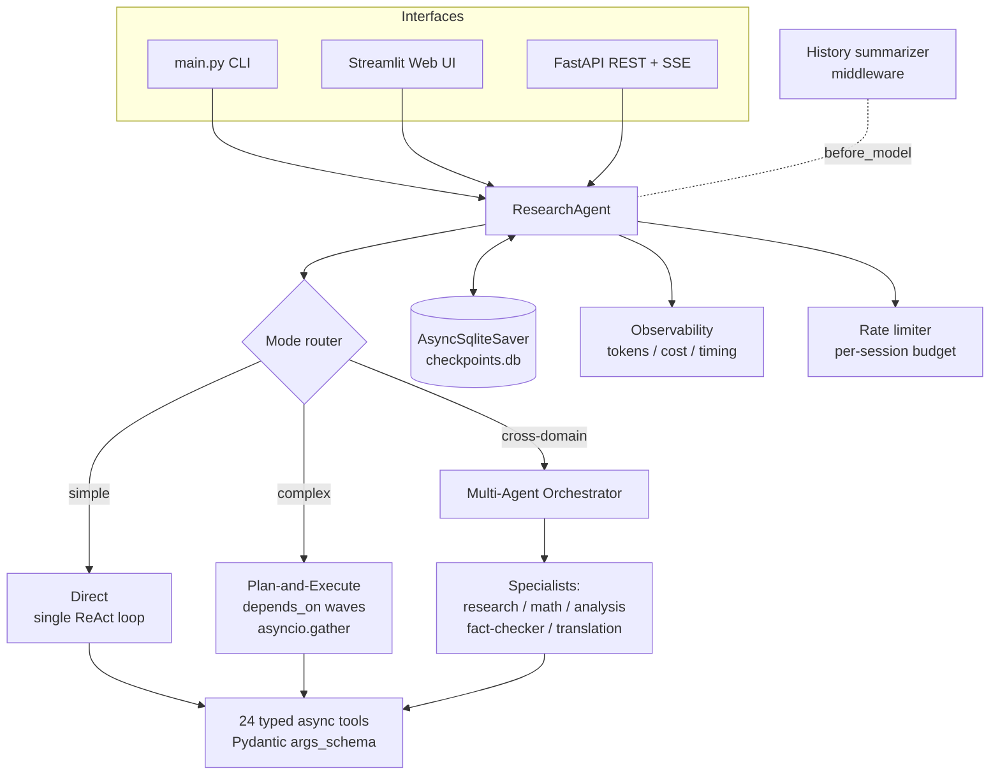

# Multi-Tool Research Agent

[](https://github.com/AlonNaor22/multi-tool-research-agent/actions/workflows/ci.yml)
[](https://www.python.org/)
[](#testing)
[](#license)

An AI research agent that picks between **three execution strategies** — single-shot, plan-and-execute, or multi-specialist orchestration — and drives **24 typed tools** (web search, Wikipedia, ArXiv, GitHub, Reddit, Wikidata, code execution, charting, and more) to answer complex questions. Built on Claude + LangGraph with end-to-end async I/O, schema-enforced tool inputs, and SQLite-backed session persistence.

> Three interfaces — **CLI**, **Streamlit web UI**, and **FastAPI REST + SSE service** — all share one async agent and one checkpointed conversation store.

---

## At a glance

- **Three execution modes** auto-routed by question complexity: `Direct` (single ReAct loop), `Plan-and-Execute` (LLM-generated plan with dependency-driven parallel steps), `Multi-Agent` (specialist orchestrator: research, math, analysis, fact-checker, translation).
- **24 production tools** with Pydantic `args_schema` — Anthropic's tool-use API enforces every input at the schema boundary, no JSON parsing in user space.
- **SQLite checkpointing** (`AsyncSqliteSaver`) auto-persists full graph state after every node; sessions resume mid-conversation across processes.
- **History summarizer middleware** trims the messages channel via the LLM when token count crosses a threshold — conversations never blow up the context window.
- **Production-ready**: bearer-token auth, per-endpoint slowapi rate limits with `Retry-After`, multi-stage Docker (~250 MB, non-root), GitHub Actions CI on every push.
- **Observability**: per-query token & cost tracking, tool success rates, timing breakdown, JSONL metrics store.

---

## Quickstart

```bash
git clone https://github.com/AlonNaor22/multi-tool-research-agent.git
cd multi-tool-research-agent
python -m venv venv
# Pick the one for your shell:
venv\Scripts\Activate.ps1                     # Windows PowerShell
# venv\Scripts\activate.bat                   # Windows cmd
# source venv/bin/activate                    # macOS / Linux

pip install -r requirements.txt
echo "ANTHROPIC_API_KEY=sk-ant-..." > .env

python main.py                # CLI
# or
streamlit run app.py          # web UI
# or
python serve.py               # REST API on :8000, docs at /docs
# or
docker compose up --build     # containerized API on :8000
```

---

## Architecture



**Execution modes**

| Mode | When | How |
|---|---|---|
| **Direct** | Simple lookups, single tool sufficient | One `create_agent` ReAct loop. Streams tokens via `astream(stream_mode="messages")`. |
| **Plan-and-Execute** | Multi-step research questions | `llm.with_structured_output(ResearchPlan)` generates ordered steps with `depends_on` edges; the executor runs each wave concurrently via `asyncio.gather`. Dependencies replay as prior `(HumanMessage, AIMessage)` pairs so the agent reasons over real conversation turns rather than pasted context. |
| **Multi-Agent** | Cross-domain queries (e.g. "compute X, verify against research") | Supervisor delegates to specialist agents (research / math / analysis / fact-checker / translation), each with its own tool subset and prompt. Findings synthesized via a structured-output supervisor call. |

`auto` mode (the default) inspects the query with a lightweight classifier and routes to Direct or Plan-and-Execute. Multi-Agent is opt-in.

---

## Tools (24)

| Category | Tools |
|---|---|
| **Math & computation** | `calculator` (arithmetic + step-by-step calculus, equations, matrix ops with KaTeX markdown output), `unit_converter`, `equation_solver` (SymPy), `currency_converter` (Frankfurter API), `wolfram_alpha`, `datetime_calculator` |
| **Information retrieval** | `web_search` (DuckDuckGo), `wikipedia`, `news_search`, `arxiv_search`, `youtube_search` (yt-dlp), `google_scholar` (Semantic Scholar), `github_search` |
| **Web content** | `fetch_url`, `pdf_reader` (pdfplumber), `web_scraper` (tables, lists, links, headings) |
| **Knowledge & social** | `wikidata` (SPARQL), `reddit_search` |
| **Code & data** | `python_repl` (sandboxed), `csv_reader` (pandas: filter, groupby, stats) |
| **Output** | `create_chart` (bar / line / pie / function plots), `translate` (deep-translator, 100+ languages) |
| **Multi-source** | `parallel_search` (web + wikipedia + news + arxiv concurrently) |
| **Weather** | `weather` (OpenWeatherMap) |

Every tool subclasses `BaseTool` with a Pydantic `args_schema` — the LLM never sees free-form JSON, every parameter is type-validated by Anthropic's tool-use API before it reaches Python code.

---

## Interfaces

### CLI
```bash
python main.py                   # direct mode
python main.py --plan            # plan-and-execute
python main.py --multi-agent     # multi-agent orchestrator
```
REPL commands: `clear` (new thread), `save`, `load`, `sessions`, `stats`, `quit`.

### Streamlit web UI
```bash
streamlit run app.py
```
Chat interface with streaming feedback, callback inbox (tool calls / plan steps), session browser, tool-health panel, per-query metrics, performance history charts, optional token-budget controls.

### FastAPI REST + SSE
```bash
python serve.py                  # binds 127.0.0.1:8000
python serve.py --reload         # dev mode
```
Interactive docs at `http://127.0.0.1:8000/docs`. Request body for query endpoints: `{ "query": "...", "mode": "auto|direct|plan|multi", "session_id": "optional" }`.

| Method | Path | Purpose |
|---|---|---|
| GET | `/health` | Service status, enabled/disabled tool lists (always open for k8s/Docker probes) |
| POST | `/query` | Run to completion; returns `{answer, session_id, tokens_used, duration_seconds}` |
| POST | `/query/stream` | Same input, streams typed SSE events (`synthesis_token`, `step_tool`, `phase_started`, `done`) |
| GET | `/sessions` | List saved threads |
| GET | `/sessions/{id}` | Load Q/A history |
| DELETE | `/sessions/{id}` | Drop a thread's checkpoints |

**Authentication**: set `API_AUTH_TOKEN` in `.env` and every protected endpoint requires `Authorization: Bearer <token>`. Unset = dev mode (warns at startup). `/health` always open.

**Rate limits** (per-IP, in-memory; swap to Redis URI for multi-worker):

| Endpoint | Limit |
|---|---|
| `POST /query`, `POST /query/stream` | 10 / minute |
| `GET /sessions`, `GET /sessions/{id}` | 60 / minute |
| `DELETE /sessions/{id}` | 30 / minute |

A 429 includes `Retry-After` plus slowapi's `X-RateLimit-*` headers.

### Docker
```bash
docker compose up --build           # build + run on :8000
docker compose up -d                # detached
docker compose logs -f api          # tail logs
curl http://localhost:8000/health   # smoke test
docker compose down                 # stop + remove
```
Multi-stage build: `python:3.12-slim` builder installs deps into `/opt/venv`, runtime stage copies just the venv + source. Final image ~250 MB, runs as non-root `app` (UID 1000). Bind-mounts `sessions/`, `output/`, `observability/` so SQLite checkpoints, chart PNGs, and metrics survive `docker compose down`. `HEALTHCHECK` probes `/health` via stdlib `urllib` (no `curl` baked into the image).

---

## Engineering highlights

- **Schema-enforced tool inputs**. Every tool is a `BaseTool` subclass with a Pydantic `args_schema`. The LLM passes typed parameters; Anthropic's tool-use API rejects bad input at the boundary. Migrated 10 string-or-JSON tools off `parse_tool_input(query, defaults)` to typed params in a single refactor.
- **Structured outputs everywhere**. `llm.with_structured_output(_PlanResponse)` for the planner, `with_structured_output(DelegationPlan)` for the multi-agent supervisor — Pydantic schemas enforce shape; no JSON string parsing in hot paths.
- **Dependency-driven plan execution**. `ResearchPlan` carries a `depends_on` graph; the executor groups steps into waves and runs each wave via `asyncio.gather`, with prior findings replayed as `(HumanMessage, AIMessage)` pairs into the dependent step's context.
- **Unified persistence**. `AsyncSqliteSaver` checkpoints full graph state (messages, summarizer counts, plan progress) after every node. Sessions are SQLite threads — list, load, resume, or delete via the same API the Streamlit UI uses.
- **History summarizer middleware**. Custom `AgentMiddleware` with `before_model` / `abefore_model` hooks. When the messages channel exceeds `HISTORY_TRIM_THRESHOLD_TOKENS` (8k), the older portion is summarized into one marked `AIMessage`; the active turn (last `HumanMessage` onward) stays verbatim. Tool-use / tool-result pairing is preserved across the drop/keep split.
- **Rate-limit-aware retries** in tool code (HTTP 429 detected, exponential backoff) plus a session-level token budget enforced by `RateLimiter`.
- **Observability**: per-query token counts (input/output), cost estimation against model-aware pricing tables, tool success rates, timing breakdown. Metrics appended to `observability/metrics.jsonl` for later analysis.
- **Tool health checks** at startup. Each tool reports availability; disabled tools are pruned from the agent's tool list AND from the system prompt's tool catalog so the LLM never even tries them.

---

## Project structure

```
multi-tool-research-agent/
├── main.py                         # CLI entry point
├── app.py                          # Streamlit web UI
├── serve.py                        # FastAPI server (uvicorn entry point)
├── Dockerfile                      # Multi-stage build for the REST API
├── docker-compose.yml              # One-command stack with volumes + env
├── .github/workflows/ci.yml        # pytest + docker-build on push/PR
├── config.py                       # Model, keys, limits (reads .env)
├── requirements.txt
├── pytest.ini
├── TODO.md                         # Implementation roadmap
├── src/
│   ├── agent.py                    # ResearchAgent + ResearchAgentState + middleware
│   ├── planner.py                  # generate_plan with_structured_output
│   ├── session_manager.py          # Session list/load/delete on SqliteSaver
│   ├── callbacks.py                # Timing, streaming, observability handlers
│   ├── observability.py            # Token tracking, cost estimation, metrics store
│   ├── rate_limiter.py             # Per-session token budget
│   ├── tool_health.py              # Startup probes + fallback guidance
│   ├── constants.py                # Shared constants (timeouts, modes, events)
│   ├── utils.py                    # Async retry, timeout, aiohttp session, TTL cache
│   ├── api/                        # FastAPI REST + SSE service
│   │   ├── app.py                  # App factory + lifespan + middleware
│   │   ├── auth.py                 # Bearer-token dependency
│   │   ├── rate_limit.py           # slowapi limiter + custom 429 handler
│   │   ├── dependencies.py         # DI providers, API_MODE_TO_INTERNAL
│   │   ├── models.py               # Pydantic request/response schemas
│   │   └── routes/                 # health, query, sessions
│   ├── multi_agent/                # Multi-agent orchestrator + specialists
│   └── tools/                      # 24 async tools (Pydantic args_schema)
├── tests/                          # 516 tests, runs in ~15s (pytest-xdist)
├── sessions/                       # SQLite checkpoint DB (gitignored)
├── output/                         # Chart PNGs (gitignored)
└── observability/                  # Metrics JSONL (gitignored)
```

---

## Testing

```bash
pytest                              # full suite, ~15s parallel
pytest tests/test_api.py            # one module
pytest -k auth                      # filter by name
```

516 tests covering: every tool's happy path + error path, agent mode routing, plan/dependency execution, multi-agent orchestration, session manager, rate limiter, observability, REST API (auth/rate-limit/SSE), Pydantic schema validation at every tool boundary.

CI runs the same `pytest` + a Docker build smoke check on every push and PR — see `.github/workflows/ci.yml`.

---

## Configuration

Edit `.env` or set environment variables directly:

| Variable | Default | Description |
|---|---|---|
| `ANTHROPIC_API_KEY` | — | **Required.** Anthropic API key. |
| `MODEL_NAME` | `claude-sonnet-4-5-20250929` | Claude model. |
| `TEMPERATURE` | `0.2` | Sampling temperature. |
| `MAX_TOKENS` | `2000` | Per-response cap. |
| `API_AUTH_TOKEN` | — | Bearer token for the REST API. Unset = dev mode. |
| `OPENWEATHER_API_KEY` | — | Enables the `weather` tool. |
| `WOLFRAM_ALPHA_APP_ID` | — | Enables the `wolfram_alpha` tool. |

---

## Example queries

- "What is 15% of 250?" → calculator (direct)
- "Find papers about transformers on ArXiv from 2023" → arxiv_search with typed `year_from`
- "Compare Python vs Rust for systems programming, with both web sentiment and benchmark data" → multi-agent (research + analysis + fact-checker)
- "Plot f(x) = x² − 4 and find its roots" → calculator + create_chart
- "What is the population of France? How does that compare to Germany?" → follow-up with session memory
- "Search Tesla on web, wikipedia, and news at the same time" → parallel_search

---

## Tech stack

**Core**: LangGraph, LangChain, Claude (Anthropic), Pydantic, aiohttp, asyncio
**Persistence**: AsyncSqliteSaver, aiosqlite
**Tools**: DuckDuckGo Search, wikipedia-api, arxiv, Semantic Scholar API, yt-dlp, pdfplumber, deep-translator, SymPy, pandas, matplotlib, BeautifulSoup
**Interfaces**: FastAPI, uvicorn, sse-starlette, slowapi, Streamlit
**Testing**: pytest, pytest-asyncio, pytest-xdist
**Packaging**: multi-stage Docker, docker-compose, GitHub Actions

---

## License

MIT
